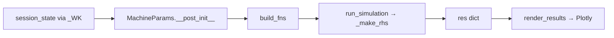

# VAULT_PLAN — Simulador de Máquinas Elétricas
> Plano arquitetural do Vault Obsidian para documentar, explicar e ensinar a construção do IWS do zero.
> Última atualização: 2026-05-23.

---

## Contexto

**Público:** engenheiro graduado + estudante de graduação (dual-track).
**Máquinas cobertas:** MIT (âncora), Motor CC, Transformador, MSIP.
**Acoplamento:** fortemente acoplado ao código do IWS — paths reais, funções reais, snippets do código atual.
**Destino:** uso pessoal / equipe pequena.

---

## Estrutura de Diretórios

```
📁 SimMEE-Vault/
│
├── 📁 00_Meta/
│   ├── INDEX.md                         ← mapa do Vault (MOC raiz)
│   ├── Roadmap.md                       ← ordem de leitura/escrita (ver VAULT_ROADMAP.md)
│   ├── Glossario.md
│   ├── Convencoes.md                    ← notação, unidades, idioma
│   └── Setup_e_Instalacao.md            ← dependências, streamlit run, ambiente virtual
│
├── 📁 00_Python_Aplicado/               ← NOVO — pré-requisito de programação
│   ├── MOC_Python_Aplicado.md
│   ├── Dataclasses_Python.md            ← @dataclass, __post_init__, campos com default
│   ├── Closures_e_Factories.md          ← funções que retornam funções (_make_rhs)
│   ├── Scipy_solve_ivp.md               ← interface do integrador (assinatura, rtol/atol/max_step)
│   ├── NumPy_Vetorizacao.md             ← operações vetorizadas, sem loops Python
│   └── Typing_Anotacoes.md             ← float | None, Callable, type hints
│
├── 📁 01_Fundamentos/
│   ├── MOC_Fundamentos.md
│   ├── Circuito_Equivalente.md          ← modelo T vs. π (origem de Xml)
│   ├── Transformacoes_Park_Clarke.md    ← dq0 de Krause, referencial estacionário
│   ├── Componentes_Simetricas.md
│   ├── EDOs_Numericas.md                ← LSODA, Runge-Kutta, passo h ≤ 1/20f
│   └── Fasores_e_Regime_Permanente.md
│
├── 📁 02_Maquinas/
│   ├── MOC_Maquinas.md
│   ├── MIT/
│   │   ├── MIT_Visao_Geral.md
│   │   ├── MIT_Modelo_dq0.md            ← 8 estados de Krause, equações de estado
│   │   ├── MIT_Regime_Permanente.md     ← curva T×n, escorregamento
│   │   ├── MIT_Parametros.md            ← Rs, Rr, Xs, Xr, Xm, J, B, p — tabela com típicos
│   │   └── MIT_Estimacao_Params.md      ← Nameplate (NEMA MG-1) + IEEE Std 112-2017
│   ├── MSIP/                            ← ⚠️ PLANEJADO — não implementado no IWS atual
│   │   ├── MSIP_Visao_Geral.md
│   │   ├── MSIP_Modelo_dq0.md           ← diff explícito vs. MIT (fluxo de ímã λ_pm)
│   │   ├── MSIP_Parametros.md
│   │   └── MSIP_Implementacao_IWS.md   ← checklist 4 arquivos: machine_model → IWS_PY → sim_config → sim_results
│   ├── Motor_CC/                        ← ⚠️ PLANEJADO — não implementado no IWS atual
│   │   ├── MCC_Visao_Geral.md           ← âncora didática para EDOs simples
│   │   ├── MCC_Modelo_EDO.md
│   │   └── MCC_Implementacao_IWS.md    ← checklist 4 arquivos; snippets do padrão MIT como referência
│   └── Transformador/                   ← ⚠️ PLANEJADO — não implementado no IWS atual
│       ├── TR_Visao_Geral.md            ← introdução a circuito equivalente sem rotação
│       ├── TR_Circuito_Equivalente.md
│       └── TR_Implementacao_IWS.md     ← checklist 4 arquivos; diferença: sem wr, sem equação mecânica
│
├── 📁 03_Backend/
│   ├── MOC_Backend.md
│   ├── Arquitetura_Camadas.md           ← fachada IWS_PY.py, solver, fontes, pós-proc
│   │
│   ├── — MODELAGEM —
│   ├── MachineParams_DataClass.md       ← todos os campos, defaults, input_mode X vs. L
│   ├── MachineParams_Derivacoes.md      ← NOVO — __post_init__: Xml, wb, Lm, Xls_a_eff
│   ├── Estado_vs_Variavel_Algebrica.md  ← NOVO — por que fluxos são estados, não correntes
│   ├── Vetor_de_Estado_8D.md            ← NOVO — y[0..7] explicados um a um, dTemp=0 e porquê
│   │
│   ├── — ODE —
│   ├── Referencial_dq0.md               ← NOVO — ref_code {0,1,2}: estacionário/síncrono/rotor; impacto nos resultados
│   ├── Machine_Model.md                 ← _make_rhs: closure, Krause linha a linha
│   ├── Sources_Tensao.md                ← voltage_fn / torque_fn — fábrica build_fns
│   ├── Solver_LSODA.md                  ← _solve: segmentação, clamp_wr, max_step; rtol/atol/max_step e performance
│   │
│   ├── — PÓS-PROCESSAMENTO —           ← NOVO (seção inteira ausente no plano original)
│   ├── Reconstrucao_Correntes_abc.md    ← _reconstruct_currents: fluxos dq → abc via Clarke-Park inverso
│   ├── Deteccao_Regime_Permanente.md    ← _detect_steady_state: janela LCM-alinhada
│   ├── Balanco_Potencia_Regime.md       ← _compute_steady_state: RMS, η, P_gap, P_cu, P_fe
│   ├── Thermal_Post_Processing.md       ← _compute_thermal: Euler implícito (por que não na ODE)
│   │
│   ├── — ANÁLISES —
│   ├── Thermal_Model.md                 ← estimate_rth_cth, modelo RC térmico
│   ├── Energy_Analysis.md               ← compute_energy_metrics: E(kWh), custo, THD, FP
│   ├── Harmonic_MCSA.md                 ← build_fig_fft, FFT de regime permanente
│   ├── Diagnostics.md                   ← generate_insights: Insight dataclass, severidades, limiares (sim_diagnostics.py) e como calibrar
│   │
│   ├── — EXTENSÃO —
│   ├── Roteador_de_Maquinas.md          ← NOVO — padrão de escolha de RHS por tipo de máquina
│   └── Como_Adicionar_Nova_Maquina.md   ← checklist 6 passos (IWS_PY → machine_model → sim_config → ...)
│
├── 📁 04_Frontend/
│   ├── MOC_Frontend.md
│   │
│   ├── — SESSION STATE —               ← NOVO (seção expandida)
│   ├── _WK_Pattern.md                   ← MOVIDO de 07_Fluxo — ler antes de Session_State; origem do padrão, alternativas descartadas
│   ├── Session_State_Widget_Keys.md     ← NOVO — widget key → session_state automático
│   ├── Cache_Streamlit.md               ← NOVO — @st.cache_data vs @st.cache_resource
│   ├── Persistencia_Resultado.md        ← NOVO — sim_result persiste entre reruns; invalidação
│   │
│   ├── — ESTRUTURA —
│   ├── Estrutura_Abas.md                ← roteamento IWS_UI.py, page_config
│   ├── Sidebar_e_Controles.md           ← render_machine_selector, presets, _PRESETS dict
│   │
│   ├── — VISUALIZAÇÃO —
│   ├── Plotly_Frames_Zero_Latencia.md   ← técnica de frames pré-calculados; estado atual vs. objetivo
│   ├── PDF_Report.md                    ← pipeline ReportLab: pdf_commons.py (base) + pdf_academico.py + pdf_industrial.py
│   └── Como_Adicionar_Nova_Aba.md       ← checklist: sim_results.py → IWS_UI.py → teoria
│
├── 📁 05_Modos_Operacao/
│   ├── MOC_Modos.md
│   ├── Partida_DOL.md                   ← template de modo; mais simples
│   ├── Partida_YD.md
│   ├── Partida_Autotransformador.md
│   ├── Partida_SoftStarter.md
│   ├── Pulso_de_Carga.md
│   ├── Modo_Gerador.md
│   ├── Desligamento.md
│   ├── Sag_de_Tensao.md
│   └── Como_Adicionar_Novo_Modo.md      ← sources.py → IWS_PY.py → sim_config.py
│
├── 📁 06_Falhas_Diagnostico/
│   ├── MOC_Falhas.md
│   ├── Desequilibrio_Tensao.md          ← abc_voltages_deseq, componentes simétricas
│   ├── Falta_de_Fase.md
│   ├── Barra_Quebrada.md                ← make_broken_bar_rr_fn, modulação de Rr(t, θ_slip)
│   └── Diagnostico_Automatizado.md      ← generate_insights, severidades, limiares
│
├── 📁 07_Fluxo_de_Dados/
│   ├── MOC_Fluxo.md
│   ├── Input_para_MachineParams.md      ← widget → _WK → MachineParams campo a campo
│   ├── MachineParams_para_Solver.md     ← dataclass → build_fns → run_simulation
│   ├── Solver_para_Plotly.md            ← res dict → figuras → st.plotly_chart
│   └── Diagrama_E2E.md                  ← diagrama Mermaid ponta-a-ponta (7 etapas)
│
├── 📁 08_Guias_Extensao/
│   ├── Checklist_Nova_Maquina.md        ← 6 arquivos, ordem exata
│   ├── Checklist_Novo_Modo.md           ← sources.py → IWS_PY.py → sim_config.py → sim_results.py
│   ├── Checklist_Nova_Aba.md
│   └── Padrao_Teste_Unitario.md
│
└── 📁 09_Snapshots_IWS/
    ├── Snapshot_Arquitetura_2026-05.md  ← estado do IWS em 2026-05-23 (auditado)
    └── Changelog_Decisoes.md            ← decisões arquiteturais + motivação
```

---

## Template de Documentação de Máquina/Módulo

```markdown
---
titulo: "{{Nome do Módulo}}"
tipo: maquina | modo | backend | frontend | falha
maquina: MIT | MSIP | MCC | TR | geral
status: rascunho | revisao | publicado
complexidade: basico | intermediario | avancado
pre_requisitos:
  - "[[Nota_A]]"
  - "[[Nota_B]]"
tags: [simulador, dq0, python, streamlit]
criado: YYYY-MM-DD
atualizado: YYYY-MM-DD
iws_arquivo: "core/machine_model.py"
iws_funcao: "_make_rhs"
iws_linhas: "183-272"
---

# {{Título}}

> **Resumo em uma frase.**

---

## Pré-requisitos

- [[Nota_A]] — motivo
- [[Nota_B]] — motivo

---

## 1. Contexto Físico

_Para o graduado:_ parágrafo direto com hipótese central.
_Para o estudante:_ analogia + link para [[nota de fundamento]].

---

## 2. Formulação Matemática

### 2.1 Equações

$$
\frac{d\psi_{qs}}{dt} = V_{qs} - R_s i_{qs} - \omega_r \psi_{ds}
$$

### 2.2 Parâmetros Envolvidos

| Símbolo | Descrição | Unidade | Típico MIT 7,5 kW |
|---------|-----------|---------|-------------------|
| `Rs`    | Resistência estator | Ω | 0,435 |

---

## 3. Implementação em Python

### 3.1 Localização no IWS

```
core/machine_model.py  →  _make_rhs()  →  linha ~183
```

### 3.2 Snippet Explicado

```python
# Fluxo mútuo eixo q — modelo π (Krause eq. 3.2)
PSImq = Xml * (PSIqs / Xls_a + PSIqr / Xlr_a)
iqs = (PSIqs - PSImq) / Xls_a
```

### 3.3 Erros Comuns

| Sintoma | Causa | Fix |
|---------|-------|-----|
| Instabilidade / divergência numérica | Passo `h > 1/(20f)` | Reduzir `h` ou diminuir `max_step` |
| `wr` em valor inesperado (~2× esperado) | Confundir rad/s elétrico com mecânico | Dividir por `p/2` para obter rad/s mecânico |
| `NaN` no `res` dict | Solver não convergiu (rtol/atol muito relaxado) | Diminuir `rtol`/`atol`; verificar parâmetros |

---

## 4. Integração com o Frontend



**Entrada:** `MachineParams` com campos validados.
**Saída:** chave específica do `res` dict (ex: `res["Te"]`).

---

## 5. Como Estender

1. Novo campo em `MachineParams` → adicionar em `_WK` (sim_config.py:87).
2. Nova equação em `_make_rhs` → verificar consistência dimensional.
3. Ver [[Checklist_Nova_Maquina]] para escopo completo.

---

## 6. Referências

- Krause, P. C. (1986). *Analysis of Electric Machinery*. Cap. X.
- IWS: `core/machine_model.py`, linha Y.

---

## Histórico de Revisões

| Data | Mudança |
|------|---------|
| YYYY-MM-DD | Criação inicial |
```

---

## API Pública do IWS (Referência Rápida)

### MachineParams — todos os campos

| Campo | Default | Tipo | Descrição |
|-------|---------|------|-----------|
| `Vl` | 220.0 | float | Tensão de linha (V) |
| `f` | 60.0 | float | Frequência (Hz) |
| `Rs` | 0.435 | float | Resistência estator (Ω) |
| `Rr` | 0.816 | float | Resistência rotor ref. estator (Ω) |
| `Xm` | 26.13 | float | Reatância de magnetização (Ω) |
| `Xls` | 0.754 | float | Dispersão estator (Ω) |
| `Xlr` | 0.754 | float | Dispersão rotor (Ω) |
| `Rfe` | 500.0 | float | Resistência perda no ferro (Ω); 1e9 desativa |
| `p` | 4 | int | Número de pares de polos |
| `J` | 0.089 | float | Inércia (kg·m²) |
| `B` | 0.005 | float | Amortecimento viscoso (N·m·s/rad) |
| `Rgrid` | 0.0 | float | Resistência série da rede (Ω/fase) |
| `Lgrid` | 0.0 | float | Indutância série da rede (H/fase) |
| `Rth` | 0.0 | float | Resistência térmica (K/W); 0 = auto |
| `Cth` | 0.0 | float | Capacitância térmica (J/K); 0 = auto |
| `T_amb` | 25.0 | float | Temperatura ambiente (°C) |
| `input_mode` | "X" | str | "X" = reatâncias Ω; "L" = indutâncias H |
| `f_ref` | 60.0 | float | Frequência de referência para conversão X→L |
| `sat_enable` | False | bool | Saturação magnética (legado, sem efeito) |

**Campos derivados por `__post_init__`:**
- `wb = 2πf` — frequência angular (rad/s)
- `Lm, Lls, Llr` — indutâncias (H) a partir de reatâncias
- `Xls_a, Xlr_a` — reatâncias na frequência de operação
- `Xls_a_eff = Xls_a + Lgrid·wb` — absorve impedância da rede no estator
- `Xml = 1/(1/Xm + 1/Xls_a + 1/Xlr_a)` — reatância mútua no modelo π

### run_simulation — assinatura

```python
run_simulation(
    mp: MachineParams,
    tmax: float,
    h: float,
    voltage_fn,               # callable(t) → Vl_line (V)
    torque_fn,                # callable(t) → Tl (N·m)
    ref_code: int = 1,        # 0=estacionário, 1=síncrono, 2=rotor
    deseq_a/b/c: float = 0.0,
    falta_fase_a/b/c: bool = False,
    t_deseq: float = 0.0,
    df_a/b/c: float = 0.0,
    clamp_wr_at_zero: bool = False,
    t_cutoff: float | None = None,
    broken_bar_severity: float = 0.0,
    t_broken_bar: float = 0.0,
) → dict
```

### Vetor de Estado (8 dimensões)

| Índice | Símbolo | Descrição | Unidade |
|--------|---------|-----------|---------|
| `y[0]` | `PSIqs` | Fluxo q estator | Wb |
| `y[1]` | `PSIds` | Fluxo d estator | Wb |
| `y[2]` | `PSIqr` | Fluxo q rotor | Wb |
| `y[3]` | `PSIdr` | Fluxo d rotor | Wb |
| `y[4]` | `wr` | Velocidade angular elétrica do rotor | rad/s |
| `y[5]` | `tetar` | Ângulo do rotor | rad |
| `y[6]` | `Temp` | Temperatura (dTemp=0 na ODE; pós-proc via Euler implícito) | °C |
| `y[7]` | `theta_slip` | Ângulo de escorregamento (para barra quebrada) | rad |

### res dict — chaves de saída

**Série temporal:**
`t`, `wr`, `n`, `Te`, `ids`, `iqs`, `idr`, `iqr`, `ias`, `ibs`, `ics`, `iar`, `ibr`, `icr`, `Va`, `Vb`, `Vc`, `Vds`, `Vqs`, `Temp`

**Regime permanente (adicionadas por `_compute_steady_state`):**
`Te_ss`, `wr_ss`, `n_ss`, `s`, `eta`, `P_gap`, `P_cu_s`, `P_cu_r`, `P_fe`, `P_in`, `P_out`, `ias_pk`, `Te_max`, `fator_pk`, `_ss_start`, `*_rms`

---

## Padrão _WK — Elo UI ↔ Cálculo

`_WK` (sim_config.py:87) mapeia chave de widget → campo de `MachineParams` ou `exp_config`:

```python
# Elétrico
"wi_Rs" → mp.Rs
"wi_Rr" → mp.Rr
"wi_Xm" → mp.Xm
# Mecânico
"wi_p"  → mp.p
"wi_J"  → mp.J
# Experimento
"exp_select"   → exp_config["tipo"]
"wi_Tl_final"  → exp_config["Tl"]
```

**Para adicionar novo parâmetro:** (1) campo em `MachineParams`; (2) entrada em `_WK`; (3) widget em `render_machine_selector`; (4) uso em `_make_rhs` ou pós-processamento.

---

## Fluxo de Dados E2E (7 etapas)

```
1. st.number_input(key="wi_Rs")
         ↓  session_state["wi_Rs"] = valor
2. _WK dict (sim_config.py:87)
         ↓  chave → campo MachineParams
3. MachineParams(**kwargs).__post_init__
         ↓  deriva Xml, wb, Lm, Xls_a_eff
4. build_fns(exp_config, mp)
         ↓  retorna (voltage_fn, torque_fn, t_events)
5. run_simulation(mp, tmax, h, voltage_fn, torque_fn, ...)
         ↓  _make_rhs → solve_ivp → pós-processamento
6. session_state["sim_result"] = {res, mp, var_keys, ...}
         ↓  persiste entre reruns do Streamlit
7. render_results(sim_result)
         ↓  res dict → Plotly frames → st.plotly_chart
```

---

## Pós-processamento — Pipeline Completo

O `run_simulation` não termina no `solve_ivp`. Há 4 etapas de pós-processamento em `solver.py`:

| Função | Linha | O que faz |
|--------|-------|-----------|
| `_reconstruct_currents` | ~201 | Fluxos dq → correntes abc via Clarke-Park inverso |
| `_detect_steady_state` | ~237 | Janela LCM-alinhada para análise de regime |
| `_compute_steady_state` | ~340 | RMS, balanço de potência, η na janela SS |
| `_compute_thermal` | ~282 | Euler implícito para temperatura (separado da ODE) |

---

## Guia de Extensão — Checklist Nova Máquina (6 passos)

1. **`core/machine_model.py`** — novo `@dataclass` com campos específicos da máquina
2. **`core/machine_model.py`** — nova `_make_rhs_<tipo>` (ex: `_make_rhs_msip` com `Te = 1.5·(p/2)·λ_pm·iqs`)
3. **`core/IWS_PY.py`** — roteador escolhe `_make_rhs` vs. `_make_rhs_msip` por `mp.tipo`
4. **`ui_components/sim_config.py`** — novos campos em `_WK`, novo preset em `_PRESETS`
5. **`ui_components/sim_config.py:235`** — adicionar novo tipo em `MACHINES`
6. **`ui_components/sim_results.py`** — novos KPIs específicos em `_kpis_destaque`

---

## Itens Pendentes no IWS (não no Vault)

| Prioridade | Item |
|------------|------|
| 🟡 | Sankey de potência e marcador T×n → converter para frames Plotly (zero latência) |
| 🟡 | Criar `.streamlit/config.toml` para fixar tema base |
| 🔵 | `_compute_thermal` não chamada em `run_simulation` (linha ~108); temperatura constante |
